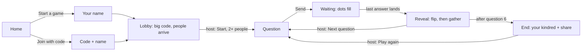

# Kindred, reimagined

Design exploration, 2026-09-23. Proposal only: nothing here changes the live game.
Prototypes are static HTML with a simulated room (bots), not the production stack.

- Recommended direction: `prototypes/kindred.html` (spec: `DESIGN.md`)
- Alternates: `prototypes/constellation.html`, `prototypes/meld.html`
- Index: `prototypes/index.html`

## 1. Intake

**The core, stated plainly.** Everyone gets the same question. Everyone answers in
secret. Then you find out who said the same thing. The thrill is the "jinx" moment: you
and a friend reaching for the same word without talking. The one real technical asset is
the judge (Jev): *couch* and *sofa* count as the same answer, so players can speak
naturally instead of guessing exact spellings.

**What exists today** (from `convex/rules.ts`, `convex/game.ts`, `app/room-view.tsx`,
`evidence/visual/*`):

| Area | Today | Cost to the player |
| --- | --- | --- |
| Modes | Host picks Hive Mind or Soulmate before play | A decision before the first fun moment; two rule sets to learn |
| Scoring | Hive: 1 per other player in your group. Soulmate: 2, or 4 if unique to your seat-paired partner | "+4 · unique partner match" needs explaining; pairs are assigned by seat order, not chosen |
| Length | 5 rounds party, 8 rounds for two players | Two lengths, two end screens (points vs. "shared 6 of 8 thoughts") |
| Reveal | Anonymous clusters, then a button, "See who thought it", then names and scores | The climax is split in two and gated behind a tap |
| Extras | Decoy "house answers" (struck through) for two players; "shared memory" override for two players; category chip ("ordinary"/"unusual") | Three concepts the player must parse that are not the game |
| Chrome | Room code, connection status, roster with seat numbers and presence, leave/close, invite drawer, all on every screen | The prompt shares the screen with ~15 other elements |
| Copy | "Before the first spark", "paths through the room", "The lights come on", "Lighting the names" | Poetic, but it describes mood instead of what happened |
| Look | Navy glass panels, blurred amber/teal blobs, Fraunces + Manrope, gold pills | Reads as a generic night-mode app; panels nest three deep |
| Deck | 14 prompts, several with huge answer spaces ("One quick errand in any decade") | Wide prompts almost never produce a match, so the core moment rarely fires |

**Locked requirements** (kept regardless of direction; from code and prior mandates):

1. Answers stay secret until everyone has answered. The server never sends another
   player's text early (`game.view`).
2. Equivalence means *same thing, different words*, not *related*: car = automobile,
   car ≠ bus. No transitive chaining (rules.ts header).
3. Judge outages are honest: a round waits and retries, never fabricates a verdict.
4. Guest identity, rooms, presence, reconnect via Parlor. No accounts.
5. 2 to 12 players, same room or on a call, phones first.

**Assumptions** (brief is silent; stated so they can be overruled):

- Primary audience: friends in one room or on a video call, 2 to 8 players, 5 to 10 minutes.
- "NYT Games level" means: one rule you can say in a sentence, one screen per moment,
  flat confident color, tactile pieces, one orchestrated reveal, a spoiler-free share.
- No `USER_STORIES.md` exists yet. Proposed stories are in section 8 for the operator.

## 2. First principles

1. **One sentence of rules.** "Answer the question. Say the same thing as someone else."
   Anything that needs a second sentence (modes, pairs, multipliers) must earn its place
   or go. Soulmate's best idea, *who is my person*, survives as an **outcome** at the end
   instead of a **mode** at the start.
2. **The prompt is the hero; the reveal is the payoff.** Every other element is chrome and
   gets hidden until asked for. On the answer screen: a question, a text field, a button.
3. **Color means one thing: you thought alike.** No decorative color. Unmatched answers
   stay plain; matched answers share a flat color, like Connections groups. That same color
   becomes the share grid.
4. **One reveal, choreographed, never gated.** When the last answer lands, the tiles flip
   and matching ones slide together. No "reveal names" step. Names are part of the joke.
5. **Prompts are a mechanic, not content.** A good prompt has a gravity well (an answer
   40% of people reach for) and a long tail. "Something in a junk drawer" matches;
   "A completely useless superpower" almost never does. Deck design decides how often the
   core moment fires.
6. **Plain words.** Say what happened: "Three of you said *pepperoni*." Not "the lights
   come on".
7. **Same game at every size.** Two players and twelve play identical rules and length.
   No house answers, no special round counts.
8. **Short and finite.** Six questions. A game ends while people still want another.

## 3. References (principles, not pixels)

| Source | Principle extracted | Applies to | Limit |
| --- | --- | --- | --- |
| NYT Wordle, https://www.nytimes.com/games/wordle (2026-09-23) | Tiles are the whole interface; flip reveal is the dopamine; the emoji grid shares the *shape* of a game without spoilers | Tile answers, flip-then-group reveal, share grid | Solo and daily; no multiplayer timing |
| NYT Connections, https://www.nytimes.com/games/connections (2026-09-23) | Four flat colors, each meaning "these belong together"; groups snap into solid bars | Group colors, the gather animation | Groups are authored; ours emerge from players |
| Jackbox Games (Quiplash, Fibbage), https://www.jackboxgames.com (2026-09-23) | Phones as private input, a shared stage for the reveal; big room code | Room code prominence; the "Big Screen" concept | Needs a TV; heavy theatrical chrome we do not want |
| Herd Mentality (Big Potato, board game) | Matching the crowd is funny because the prompts have obvious and less obvious answers | Deck principle 5; group-size headline | Physical pink cow penalty does not translate |
| "Say the Same Thing" / Mind Meld (folk word game) | If you miss, both words become the next clue; you converge | "Meld" concept | Best for two; long chains stall at twelve |
| Apple HIG, Motion, https://developer.apple.com/design/human-interface-guidelines/motion (2026-09-23) | Motion explains change; honor Reduce Motion with a crossfade | Reveal motion spec | Not about games |

## 4. Journey (synthesis)

Room chrome (code, invite link, people, sound, leave, close) lives in one sheet behind a
"Room" button on every screen. Connection problems appear as one thin banner only while
they are happening.

## 5. Six concepts

Each differs from its siblings in structure or behavior, not paint.

### A. Quiet Room (conservative)
- **Stance:** Keep today's rules and IA; remove the noise.
- **Divergence:** Differs from today only at the hierarchy layer: one column, light
  theme, chrome in a sheet, plain copy. Both modes and the two-step reveal remain.
- **Archetype:** operate.
- **Dimensions:** job unchanged (pick mode, answer, reveal, reveal names); single page
  with stacked sections; airy; Newsreader + Franklin; flat white; cards; tap-driven; by phase.

### B. One Rule (evolutionary)
- **Stance:** One mode, one sentence, one screen per moment; color only for matches.
- **Divergence:** Differs from A at the rules and content layer: modes, pairs, house
  answers, category chips, and the names gate are deleted; the reveal becomes one
  choreographed moment; the end screen names your kindred.
- **Archetype:** decide/learn (you learn who thinks like you).
- **Dimensions:** job "find my matches"; phase-per-screen stack; single centered column;
  one hero per screen; serif prompt + grotesk UI; white paper, flat group colors; tiles;
  flip-then-gather motion; by round.

### C. Big Screen (radical, structural)
- **Stance:** The host's laptop or TV is the stage; phones are private notepads.
- **Divergence:** Differs from B at the navigation layer: two surfaces with different
  jobs. Phones never show the reveal; the stage never shows an input.
- **Archetype:** monitor (stage) + operate (phone).
- **Dimensions:** job "perform the reveal for the room"; stage/controller split;
  16:9 canvas vs. phone pad; huge type at distance; theatrical color; big tiles; timed
  auto-advance; by round.

### D. Daily (radical, distribution)
- **Stance:** One question a day for your circle; answer whenever; see matches as
  friends answer.
- **Divergence:** Differs from B at the time layer: asynchronous, persistent circles,
  streaks, no room, no host.
- **Archetype:** explore.
- **Dimensions:** job "check in with my people"; calendar/feed; card per day; low
  density; one family; flat; streak counter; no live motion; by day.

### E. Meld (wildcard, mechanic)
- **Stance:** For two. If you miss, both answers become the next clue, and you try
  to meet in the middle. Count the tries.
- **Divergence:** Differs from every sibling at the rules layer: a round lasts until
  you match; the prompt after the first try is your two previous answers.
- **Archetype:** decide/learn.
- **Dimensions:** job "converge with one person"; ladder of attempts; two-column you/them
  layout meeting at a center line; big bold sans; two player hues that blend on a match;
  columns slide inward; by attempt.

### F. Constellation (radical, content model)
- **Stance:** The game is a picture of your group. Every shared answer draws a line
  between two people; by the end the room has a constellation.
- **Divergence:** Differs from B at the content-organization layer: organized by
  person and relationship, not by round. The reveal adds lines to one persistent map.
- **Archetype:** explore.
- **Dimensions:** job "see how our group is connected"; one persistent canvas; spatial
  layout, players as points on a ring; sparse; one grotesk family; paper chart, ink
  lines; nodes and edges; lines draw in; by relationship.

## 6. Comparative critique

Judged against the primary job: *a group of friends feels the jinx moment often, and
understands everything on screen without instruction.*

### A. Quiet Room: rejected as spine
- Optimizes: lowest migration; every current feature survives.
- Sacrifices: the noise is structural. Two modes, a gated reveal, decoys, and pairing
  rules stay; a lighter theme on the same decisions is still noisy.
- Wins for: shipping this week.
- Fails when: a new player joins mid-evening and has to learn Soulmate scoring.
- Keep: the Room sheet (all chrome behind one button); the banner-only connection state.

### B. One Rule: survives, becomes the spine
- Optimizes: time to first jinx; rules fit in one sentence; the reveal is the climax.
- Sacrifices: Soulmate as a mode; decoy answers; competitive depth for rules lawyers.
- Wins for: 2 to 8 friends on phones, in a room or on a call.
- Fails when: prompts are too wide and nobody matches. Mitigated by deck principle 5.
- Keep: everything; it is the structure.

### C. Big Screen: rejected for now
- Optimizes: theater for 6+ people on a couch.
- Sacrifices: remote play and two-player play, which are most sessions; needs a second
  device and a casting step.
- Wins for: living-room parties with a TV.
- Fails when: friends are on a video call.
- Keep: huge room code on the lobby; the reveal is built as a component that could
  later render on a stage URL unchanged.

### D. Daily: rejected as the game, kept as a later layer
- Optimizes: retention; the NYT habit loop.
- Sacrifices: the live jinx moment (the core); needs persistent circles, which Parlor
  guest identity does not provide.
- Wins for: long-distance friends and families.
- Fails when: half the circle answers two days late; the reveal has no moment.
- Keep: the spoiler-free share grid; the finite length.

### E. Meld: survives as a finalist and a possible second mode for exactly two
- Optimizes: two-player play, which today is the weakest (binary match each round,
  propped up by decoys).
- Sacrifices: does not scale past two; one more rule.
- Wins for: couples and pairs.
- Fails when: two players keep diverging; needs a gentle cap (6 tries).
- Keep: "try again from where you both landed" as the honest answer to a miss.

### F. Constellation: survives as a finalist; graft its outcome
- Optimizes: the end-of-game payoff; a shareable picture of the group.
- Sacrifices: per-round clarity. A ring of 8 names with lines is harder to read in one
  glance than grouped tiles, and small text on a canvas hurts mobile.
- Wins for: the end screen, 4 to 8 players.
- Fails when: two players (one line), or 12 (a hairball).
- Keep: "who is your kindred" as the end-of-game headline; relationships as the result.

## 7. Synthesis: Kindred

- **Spine:** B, One Rule. Phase-per-screen, one mode, flip-then-gather reveal, color only
  for matches.
- **Grafts:**
  - Room sheet and banner-only connection state from A: removes ~15 always-on elements.
  - "Your kindred" end headline from F: Soulmate's emotional payoff, emergent from play
    instead of assigned by seat order.
  - Spoiler-free share grid from D: one row per question, one square per player, colored
    by group.
  - Big lobby code from C.
  - "We meant the same thing" stays, generalized to any two players, both must agree
    (today it only exists for two-player rooms).
- **Dropped:** modes; seat-order pairs; 2x/4x scoring; house answers; category chips;
  the separate names step; 5 vs. 8 round lengths; ambient blobs and glass; poetic status
  copy.
- **Open decision (for the operator):** whether Meld ships as the two-player variant.
  Recommendation: ship Kindred alone first; test Meld with real pairs before adding a second
  rule set.

### Scoring, stated once (superseded by `MECHANICS.md`)

Round 2 found that this scoring rewards the obvious answer and that two friends who read
each other almost never beat a table that plays it safe. The recommended replacement is
Call it with taken answers; see `MECHANICS.md`. The original text is kept below for lineage.

Each question: you get one dot for every other person who said the same thing as you.
End of game: dots are shown per player, but the headline is not the leader. The headline
is the pair who matched most ("Priya and Theo are kindred: 4 of 6") and, for you, the
person you matched most. This is today's Hive Mind scoring (`hiveMindRoundScores`) unchanged,
plus a pairwise tally (new, pure, derivable from stored clusters).

### Deck

Replace the 14-prompt deck with prompts that have a gravity well. Examples used in the
prototype: *Something you'd find in a junk drawer*, *A famous duo*, *The best pizza
topping*, *Something that's always sticky*, *A smell from your childhood*, *The first
thing you'd grab in a fire*. Rule for authors: before adding a prompt, write the answer you
expect 40% of people to give. If you cannot, the prompt is too wide.

## 8. Proposed user stories (for the operator to accept or edit)

- **US-001 Find a match.** Given a question, each player answers in secret; after the
  last answer, every player sees all answers grouped by sameness, with names, in one
  reveal and without tapping anything.
- **US-002 Understand without instructions.** A first-time player can say the rule in one
  sentence after one question; no screen shows a mode, a multiplier, or a pairing.
- **US-003 Know my kindred.** After the sixth question, each player sees who they matched
  most, and the room sees the pair that matched most.
- **US-004 Share without spoilers.** A player can copy a result grid that shows the shape
  of the game (colors per question) and no answer text.
- **US-005 Disagree with the judge.** When two players believe their answers mean the same
  thing, both can agree to count them as a match; one player alone cannot.
- **US-006 Join fast.** A friend with a code or link is in the lobby after typing a name
  once; the host can start with two people present.

## 9. Lineage

| Concept | Verdict | Where it went |
| --- | --- | --- |
| A Quiet Room | rejected as spine | Room sheet, banner connection state |
| B One Rule | spine | Kindred |
| C Big Screen | rejected for now | Lobby code; reveal kept stage-portable |
| D Daily | later layer | Share grid, fixed length |
| E Meld | finalist, open decision | `prototypes/meld.html` |
| F Constellation | finalist, grafted | End headline; `prototypes/constellation.html` |

What a further round would test: real play with the new deck (match rate per prompt),
and Meld with three real pairs. Both need people, not more mockups.

## 10. Refine pass on the Kindred prototype (before and after)

Driven by rendered review of every state at 390 by 844 and 1280 by 800, not by restyling.

| Critique finding | Change | Fixed |
| --- | --- | --- |
| Sticky bottom action bar drew a visible seam at fractional pixel ratios | Action sits at the bottom through flex layout, not `position: sticky` | Seam gone; rule recorded in DESIGN.md Layout |
| Loner tiles and the third member of a group packed left, reading as leftovers | Loners and group members wrap centered | Symmetric boards at 3, 5 players |
| Invite link competed with Start game at the bottom of the lobby | Moved under the room code as a text button | One primary action per screen |
| Dots plus numbers for match counts said the same thing twice | Numbers only: "3 matches" | Quieter lists |
| Current-question dot looked like a target glyph | Current dot is a larger filled marigold dot | Reads as "you are here" |
| Placeholder (2.8:1) and "Thinking" (2.1:1) failed AA | Placeholder #737370 (4.8:1); "Thinking" in `quiet` italic | axe clean on all 23 states |
| After "We meant the same thing", an existing group changed color | Colors are stable per round; you join their group and its color | Rule in DESIGN.md Colors |

## 11. Scope of this exploration

- Explored: every player-facing screen of one game, from home to end, plus the room sheet,
  override, connection, and slow-judge states.
- Specified but not prototyped: override decline, join errors, joining mid-round, the
  receiving side of an override request.
- Not explored: sound, the OG image and social card redraw, a stage or TV view, a daily
  mode, the marketing surface.
- Prototype judge is authored synonym lists (`prototypes/sim.js`), not Jev. It proves the
  interface, not match rates.

## 12. Finalist evidence (rendered, 2026-09-23)

Screenshots live outside the repo under `~/.cache/tmp/kindred-design/{kindred,constellation,meld}/`
at 390 by 844 and 1280 by 800. axe-core 4.10: no violations on 23 Kindred, 10 Constellation,
and 10 Meld states. `design-check`: 0 findings on all prototype files. Reduced motion
verified on the Kindred reveal (groups land, headline appears, no movement).

What building the alternates showed, beyond the paper critique:

- **Constellation** is beautiful at the end and hard mid-game. Even after routing edges around
  the question and raising labels to 13px, a reveal takes a second read to see who matched
  whom, and labels sit apart from their points. Confirms: graft the end headline, not the
  canvas.
- **Meld** reads clearly: the ladder, "Somewhere between X and Y", and the fused tile make the
  converge rule obvious in one try. Its cost is the second rule set, not legibility. Worth a
  real test with pairs before deciding.
